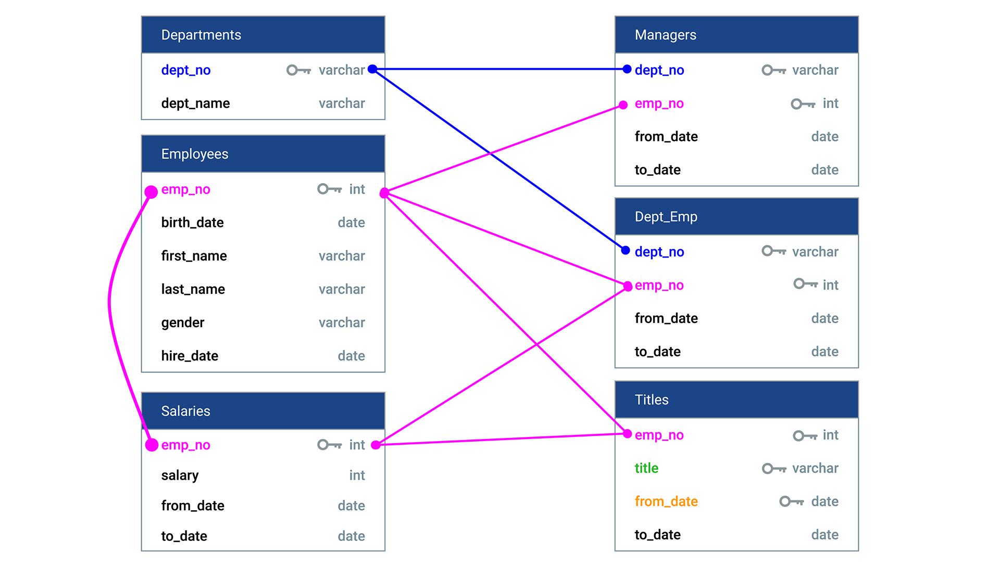
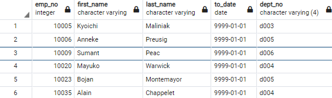
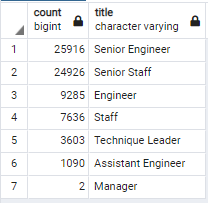
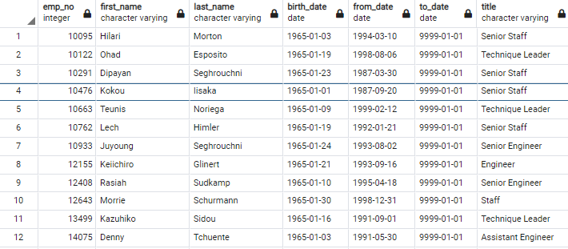
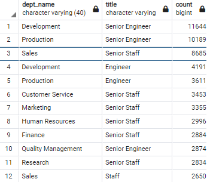

# Pewlett-Hackard-Analysis
Identifying Data Relationships with PostgreSQL and pgAdmin.

## Table of Contents
- [Overview of Project](#OverviewProject)
  * [Background](#Background)
  * [Purpose](#purpose)
- [ERD of Database](#erd)
- [Results](#results)
    * [Total Number of retiring Employees](#ret)
    * [Total number of retiring employees per title](#retempl)
    * [The Employees Eligible for the Mentorship Program](#mentor)
- [Analysis Summary](#Summary)
- [Resources](#resources)


## <a name="OverviewProject"></a>Overview of Project
### <a name="Background"></a>Background

**Pewlett-Hackard** is a large company hosting large number of eployees who have been around for a long time. Many of these employees are beginning to retire at a rapid rate. **PH** is looking towards the future in 2 ways:
1. Offering retirement package for those who meet certain criteria
2. It is starting to think which positions will need to be filled in near future.

***Hence Pewlett-Hackard (PH) needs to look ahead in future and prepare for the vacancies.***


### <a name="Purpose"></a>Purpose

My task is to perform employee research, specifically to find answers to the below questions:
1. Who would be retireing in the near future?
2. How many vacancies need to be filled when the employees retire.

PH has been mainly using excel and VBA to work with data, hence their data is mainly aggregated in 6 csv files:
 * [employees.csv](Data/employees.csv)
 * [departments.csv](Data/departments.csv)
 * [dept_emp.csv](Data/dept_emp.csv)
 * [dept_manager.csv](Data/dept_manager.csv)
 * [titles.csv](Data/titles.csv)
 * [salaries.csv](Data/salaries.csv)

We have used **SQL for our analysis** and created an employee database using SQL by applying data madelling engineering and analysis skills. For this purpose we are using the below applcations for our analysis:
1. **QuickDBD** - to create an **entity relationship diagram (ERD)** which is a flowchart that highlights different tables and their relationships to each other.
2. **PostgreSQL**- It is a relational database system, which consists of tables and their predefined relationships.
3. **pgAdmin** - It is the window into our database: it's where queries are written and executed and where results are viewed.

## <a name="erd"></a>ERD of Database

Below is the **entity relationship diagram (ERD)** of the database. We have created this using **QuickDBD**. It is a cenceptual design of the database tables, detailing the columns, data types of every column, keys and constraints. It does not contain any data, and lets us understand the relationship between all the tables.

<p align="center"> <kbd>  </kbd> </p>
<p align="center"> <b> <i>ERD of Database</i></b> </p>

     
## <a name="results"></a>Results

### <a name="ret"></a>Total number of retiring employees
In order to get the total number of retiring employees in **Pewlett-Hackard**, we need to filter the employees who were born in the years 1952 to 1955.

Query:

```
-- Number of employees retiring
SELECT e.emp_no,
    e.first_name,
    e.last_name,
    de.to_date, de.dept_no
 	INTO retiring_emp
	FROM employees as e
    LEFT JOIN dept_emp as de
    ON e.emp_no = de.emp_no
	WHERE (e.birth_date BETWEEN '1952-01-01' AND '1955-12-31')
    and de.to_date = ('9999-01-01');
```
Below is a snapshot of the output:
<p align="center"> <kbd>  </kbd> </p>

<p align="center"> <i><b>Total Number of employees retiring</b></i> </p>

### <a name="retempl"></a>Total number of retiring employees per title

Total employees in the organization: **3,00,024**
Total number of retiring employees are the employees born between 'January 1, 1952 and December 31, 1955': **72,458**

Query :

```
-- Retrieve the retireing employees information
SELECT e.emp_no, e.first_name,
e.last_name ,
t.title, t.from_date, t.to_date 
INTO retirement_table
FROM employees as e
Left JOIN titles AS t
ON (e.emp_no = t.emp_no)
WHERE (e.birth_date BETWEEN '1952-01-01' AND '1955-12-31')
ORDER BY e.emp_no;
```
```
-- Get the unique records of employees
SELECT Distinct on (emp_no) emp_no,
first_name,
last_name , title
into unique_titles
from retirement_table
Where to_date = '9999-01-01'
ORDER BY emp_no, to_date DESC
```

```
-- Count the employees by the titles
select count(title),title
into retiring_titles
from unique_titles
group by title
order by count desc;
```

<p align="center"> <kbd>  </kbd> </p>

<p align="center"> <i><b>Number of retiring employees per Title</b></i> </p>


Output: <br>
[retiring_titles.csv](Data/Challenge_Output/delivery1/retiring_titles.csv) stores the required output in csv. 

From the above output image we can conclude the following:

1. A total of **72,458 employees** will be retiring soon in the coming years. ie 24% of the total employees.
2. There are more than **25,000 employees** retiring from the title of **"Senior Engineer"** and **'Senior Staff"**. 
3. Senior Engineer, Senior staff and Engineer titles hold the largest share (83%) of retireing employees.
3. Only **2 employees** would be retiring from the **"Manager"** title.


### <a name="mentor"></a>The Employees Eligible for the Mentorship Program

The Employees Eligible for the Mentorship Program

Since a huge number of employees are retiring soon, *Pewlett-Hackard** is planning to mentor its current employees  who were born between **January 1, 1965 and December 31, 1965**.

Using the below query we are filtering the current employees and their imformation (to_date = "9999-01-01") who were born between January 1, 1965 and December 31, 1965.

```
SELECT distinct on (e.emp_no) e.emp_no, e.first_name,
e.last_name , e.birth_date,
de.from_date, de.to_date ,
t.title
INTO mentorship_eligibilty
FROM employees as e
Left JOIN dept_emp AS de
ON (e.emp_no = de.emp_no)
Left JOIN titles AS t
ON (e.emp_no = t.emp_no)
WHERE (e.birth_date BETWEEN '1965-01-01' AND '1965-12-31')
and de.to_date = ('9999-01-01')
ORDER BY e.emp_no;
```
  <p align="center"><kbd> </kbd> </p> 
<p align="center"> <i><b>Employees eligible for mentorship program</b></i> </p>


Output: <br>
[mentorship_eligibilty.csv](Data/Challenge_Output/delivery2/mentorship_eligibilty.csv) stores the required output in csv. 

From the above output image we can conclude that there are only **1,549** employees eligible for the Mentorship program. This is a low number of employees eligible compared to the large number of employees retiring. Hence Pewlett Hackard will have to make future plans to may be hire more employees. 


## <a name="Summary"></a>Analysis Summary

**How many roles will need to be filled as the "silver tsunami" begins to make an impact?**
Since a large number of employees are soon to retire, a good planning is essential in order to understand how many roles will need to be filled. In order to get a clear insight, I aggregated the data for every department and title. 'Count' is the number of roles that need to be filled in for each title in every department. This report will be helpful to the managers in every department to to plan ahead. 

Below is the snapshot of this [Query](Queries/Employee_Database_challenge.sql):

<p align="center"> <kbd>  </kbd> </p>  
	<p align="center"> <i><b> Number of retiring employees per department and title</b></i> </p>

Output: <br>
[dept_title_ret.csv](Data/Challenge_Output/delivery3/dept_title_ret.csv) stores the required output in csv. 

 
**Are there enough qualified, retirement-ready employees in the departments to mentor the next generation of Pewlett Hackard employees?**

In the analysis above we had concluded that there are only **1,549** employees eligible for the Mentorship program. Since this number is very small as compared to the the number of employees retiring, we can conclude that there are retirement-ready employees in the departments to mentor the next generation.


## <a name="resources"></a> Resources
[1] [Database Design Queries](Queries/schema.sql) <br>
[2] [Queries for the Challenge](Queries/Employee_Database_challenge.sql) <br>
[4] Software: 
* PostgreSQL 14.0 <br>
* pgAdmin
* [Quick DBD](https://app.quickdatabasediagrams.com/#/) <br>
* Visual Studio Code 1.64.2
 
